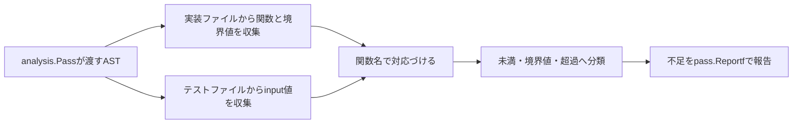

# 01. Analyzerの構成

この文書では、境界値のテストケース不足を検出するanalyzerの処理構造を説明します。

## 処理の流れ



## 主なファイル

| ファイル | 役割 |
|---|---|
| `boundary/analyzer.go` | ASTの走査、値の収集、照合、診断 |
| `cmd/boundary/main.go` | analyzerをCLIとして起動 |
| `examples/shipping/` | 解析対象となる実装コードとテストコード |
| `boundary/testdata/` | analyzerの診断を検証するテストデータ |

## Analyzerの起動

`cmd/boundary/main.go`は`singlechecker.Main`へ`boundary.Analyzer`を渡します。

```go
func main() {
	singlechecker.Main(boundary.Analyzer)
}
```

`boundary.Analyzer`は`inspect.Analyzer`へ依存し、`run`で`inspector.Inspector`を受け取ります。

```text
singlechecker
  -> analysis.Analyzer
    -> run(pass)
      -> ASTを走査
        -> pass.Reportf
```

## 境界値を収集する

実装ファイルの`*ast.FuncDecl`から関数の本体をたどり、次の形を探します。

```text
FuncDecl
└── Body
    └── IfStmt
        └── Cond: BinaryExpr
            ├── X: Ident(total)
            ├── Op: token.LSS
            └── Y: BasicLit(5000)
```

取得した関数名、値、ソースコード上の位置は`boundaryInfo`として保持します。

```go
type boundaryInfo struct {
	functionName string
	value        int64
	pos          token.Pos
}
```

## テスト入力を収集する

テスト関数名から`Test`を除き、実装側の関数名と対応づけます。

```text
TestShippingFee -> ShippingFee
```

テーブルテストでは`*ast.KeyValueExpr`のうち、キーが`input`で、値が整数リテラルのものだけを収集します。これにより、`want`フィールドの数値をテスト入力として扱うことを防ぎます。

```go
map[string][]int64{
	"ShippingFee": {4999, 5001},
}
```

## 境界との位置関係を分類する

境界値`b`ごとに、収集したテスト入力を3つへ分類します。

| 分類 | 条件 | `b = 5000`の例 |
|---|---|---:|
| 未満 | `input < b` | 4999 |
| 境界値 | `input == b` | 5000 |
| 超過 | `input > b` | 5001 |

不足している分類があれば、保存しておいた`token.Pos`を使い、ソースコード上の位置を示す診断を出します。

```text
examples/shipping/shipping.go:4:13: ShippingFee: boundary value 5000 is not tested
```

## analyzerのテスト

`step3-complete`ブランチでは、テストデータを使ったテストを次のコマンドで実行できます。

```bash
go test -tags workshop_solution ./boundary -v
```

境界値の不足、前後の値の不足、`want`フィールドの除外、複数関数の分離などを診断内容で検証します。

## 応用課題3：名前付き定数への対応

この課題はStep 3の完了状態から始めます。`types-complete`ブランチでは、比較式の右辺が名前付き定数の場合も`analysis.Pass.TypesInfo`と`go/constant`を使って値を取得します。

```go
const freeShippingBoundary = 5000

if total < freeShippingBoundary {
	// ...
}
```
