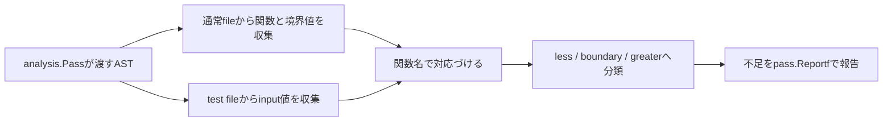

# 01. Analyzer Architecture

この文書では、境界値のtest case不足を検出するanalyzerの処理構造を説明します。

## 処理の流れ



## 主なfile

| file | 役割 |
|---|---|
| `boundary/analyzer.go` | ASTの走査、値の収集、照合、診断 |
| `cmd/boundary/main.go` | analyzerをCLIとして起動 |
| `examples/shipping/` | 解析対象となるproduction codeとtest |
| `boundary/testdata/` | analyzerの診断を検証するfixture |

## Analyzerの起動

`cmd/boundary/main.go`は`singlechecker.Main`へ`boundary.Analyzer`を渡します。

```go
func main() {
	singlechecker.Main(boundary.Analyzer)
}
```

`boundary.Analyzer`は`inspect.Analyzer`へ依存し、`run`で`inspector.Inspector`を受け取ります。

```text
singlechecker
  -> analysis.Analyzer
    -> run(pass)
      -> ASTを走査
        -> pass.Reportf
```

## 境界値を収集する

通常fileの`*ast.FuncDecl`から関数bodyをたどり、次の形を探します。

```text
FuncDecl
└── Body
    └── IfStmt
        └── Cond: BinaryExpr
            ├── X: Ident(total)
            ├── Op: token.LSS
            └── Y: BasicLit(5000)
```

取得した関数名、値、source位置は`boundaryInfo`として保持します。

```go
type boundaryInfo struct {
	functionName string
	value        int64
	pos          token.Pos
}
```

## test入力を収集する

test function名から`Test` prefixを除き、production function名と対応づけます。

```text
TestShippingFee -> ShippingFee
```

test tableでは`*ast.KeyValueExpr`のうち、keyが`input`でvalueが整数literalのものだけを収集します。これにより、`want` fieldの数値をtest入力として扱うことを防ぎます。

```go
map[string][]int64{
	"ShippingFee": {4999, 5001},
}
```

## 境界との位置関係を分類する

境界値`b`ごとに、収集したtest入力を3つへ分類します。

| 分類 | 条件 | `b = 5000`の例 |
|---|---|---:|
| less | `input < b` | 4999 |
| boundary | `input == b` | 5000 |
| greater | `input > b` | 5001 |

不足している分類があれば、保存しておいた`token.Pos`を使ってsource位置付きの診断を出します。

```text
examples/shipping/shipping.go:4:13: ShippingFee: boundary value 5000 is not tested
```

## analyzerのtest

`core-complete` branchでは、fixtureを使ったtestを次のcommandで実行できます。

```bash
go test -tags workshop_solution ./boundary -v
```

boundaryの不足、左右の値の不足、`want` fieldの除外、複数関数の分離などを診断messageで検証します。

## named constantへの対応

`types-complete` branchでは、比較式の右辺がnamed constantの場合も`analysis.Pass.TypesInfo`と`go/constant`を使って値を取得します。

```go
const freeShippingBoundary = 5000

if total < freeShippingBoundary {
	// ...
}
```
