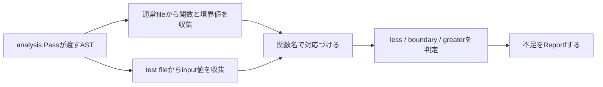

# Core Implementation Walkthrough

この文書は、Core完成版の実装意図と、ハンズオンでどこを参加者に書いてもらうかを整理する講師用メモです。参加者向けの説明では、一度にすべての実装を見せず、Stepごとに開示します。

## 1. Coreの処理の流れ



中心となるfileは次の3つです。

| file | 役割 |
|---|---|
| `boundary/analyzer.go` | ASTの走査、値の収集、照合、診断 |
| `cmd/boundary/main.go` | analyzerをCLIとして起動 |
| `examples/shipping/` | 当日一貫して使うproduction codeとtest |

## 2. file取得の方針

Coreでは`filepath.Glob`で`*_test.go`を探したり、`parser.ParseFile`で再解析したりしません。`inspect.Analyzer`が作る`inspector.Inspector`を使い、`analysis.Pass`に含まれるASTを走査します。

`singlechecker`は標準でtestを含むpackage variantも解析します。通常fileだけのvariantではproduction codeとtest codeを照合できないため、Core実装はtest functionを1つも見つけられなければ何も報告せず終了します。通常fileとtest fileの両方を含むvariantでだけ照合と診断を行います。

この設計により、参加者には次の理解へ集中してもらえます。

- `analysis.Pass`から解析対象の情報を受け取る
- ASTを一度だけ走査する
- source位置には既存nodeの`Pos`を使う

一方で、testを読み込まない実行方法では照合できません。これはCoreの制約として明記し、汎用版での設計課題として残します。

## 3. Step 1: 関数を見つけて報告する

参加者が新しく触る概念は3つに絞ります。

1. `analysis.Analyzer`
2. `*ast.FuncDecl`
3. `pass.Reportf`

最初の成功出力は次です。

```text
found function ShippingFee
```

`singlechecker.Main`、`inspect.Analyzer`の登録、CLI起動部分はstarterへ用意します。参加者が書く中心は、`FuncDecl`を対象にした`Preorder`と`Reportf`です。

この時点では境界値checkerを作ろうとせず、「sourceに書いた関数がAST nodeとして見つかり、診断になった」という体験を優先します。

外部のAST Viewerを開けない場合は、次のlocal commandで式のASTを表示できます。

```bash
go run ./cmd/astdump 'total < 5000'
```

## 4. Step 2: if文から境界値を抽出する

Golden Pathのconditionは次の形だけです。

```go
if total < 5000 {
```

ASTでは次の順に確認します。

```text
FuncDecl
└── Body
    └── IfStmt
        └── Cond: BinaryExpr
            ├── X: Ident(total)
            ├── Op: token.LSS
            └── Y: BasicLit(5000)
```

参加者が書く中心は、型assertionとoperatorの確認です。parameterが1つの`int`かを確認する処理や整数literalのparseは、時間計測後にstarter側へ移しても構いません。

Step 2の成功出力は次です。

```text
ShippingFee: found boundary value 5000
```

## 5. Step 3: test値と照合する

test function名から`Test`を除いた文字列をproduction function名として扱います。

```text
TestShippingFee -> ShippingFee
```

test tableでは`*ast.KeyValueExpr`のうち、keyが`input`でvalueが整数literalのものだけを集めます。`want: 5000`を誤ってinputとして扱わないことが重要です。

境界値`b`について、集めた値を3つに分類します。

| 状態 | 判定 |
|---|---|
| less | `input < b`が1つ以上ある |
| boundary | `input == b`が1つ以上ある |
| greater | `input > b`が1つ以上ある |

Golden Pathでは4999と5001を最初から用意し、5000だけを不足させます。参加者は1 caseを加えるだけで診断が消えることを確認できます。

## 6. starterへ含めるcode

90分のうち実装時間は約50分です。学習目標ではないboilerplateは、次のようにstarterへ含めます。

| starterで提供 | 参加者が実装 |
|---|---|
| moduleと依存関係 | `FuncDecl`の走査 |
| `singlechecker`の`main` | 一時診断の`Reportf` |
| `Analyzer`のmetadataと`Requires` | `IfStmt`と`BinaryExpr`の確認 |
| 題材のproduction codeとtest | `<`と右辺literalの確認 |
| test fixtureとtest harness | `input`だけを集めるfilter |
| 診断messageの定数または見本 | 3分類と不足時の報告 |

参加者が一度に書くcodeは10〜20行を目安にし、長いhelperは穴埋めにするかcheckpoint側へ含めます。

## 7. 自動test

Core完成版では次を固定しています。

- boundaryだけ不足する
- 3分類がすべて揃う
- lessだけ不足する
- greaterだけ不足する
- `want` fieldの5000をinputへ混ぜない
- 別functionのtest値を混ぜない
- Core非対応の構文を解析対象にしない

`boundary/analyzer_test.go`はfixtureの通常fileとtest fileを同じ`analysis.Pass`へ渡し、実際の`Analyzer.Run`から得た診断messageを比較します。ハンズオンではtest harnessを参加者に書かせず、実装結果をすぐ確認する安全網として提供します。

## 8. CLIとCIのデモ

まず通常のtestとcoverageを見せます。

```bash
go test -cover ./examples/shipping
```

境界値5000がなくても、4999と5001で両方のreturnを実行するためstatement coverageは100%になります。ここで冒頭の経験談と実装結果がつながります。

直接実行する場合:

```bash
go run ./cmd/boundary ./examples/shipping
```

`go vet`へ組み込む場合:

```bash
go build -o boundary-checker ./cmd/boundary
go vet -vettool="$(pwd)/boundary-checker" ./examples/shipping
```

CIでは上の2コマンドをjobへ追加します。当日の最後は設定fileを詳しく書く時間にせず、同じ診断がCIでも失敗として扱われることを見せます。

## 9. CoreからExtraへの境界

Coreで右辺を`*ast.BasicLit`に限定したことが、`go/types`へ進む自然な入口になります。

```go
const freeShippingBoundary = 5000

if total < freeShippingBoundary {
```

ASTだけでは右辺がidentifierであることまでしか分かりません。`TypesInfo`と`go/constant`を使うと、そのidentifierがconstantを指し、値が5000であることを取得できます。

一方、実行時に決まる一般変数は`go/types`だけでは値を確定できません。代入関係の追跡やSSA/data flowが必要になります。Extraでは「typesでできる範囲」と「そこから先」の境界を見せるところまでを狙います。
